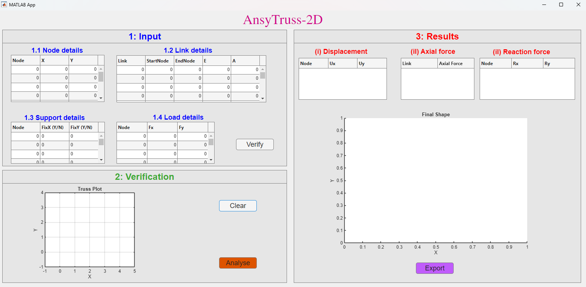
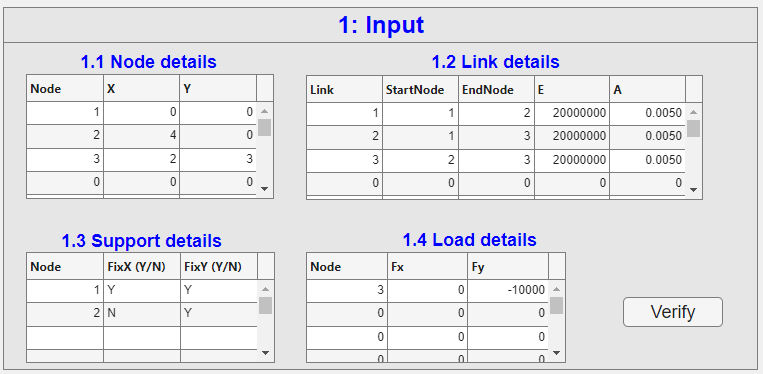
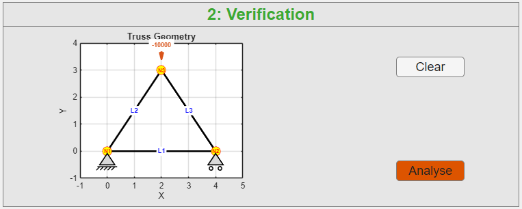
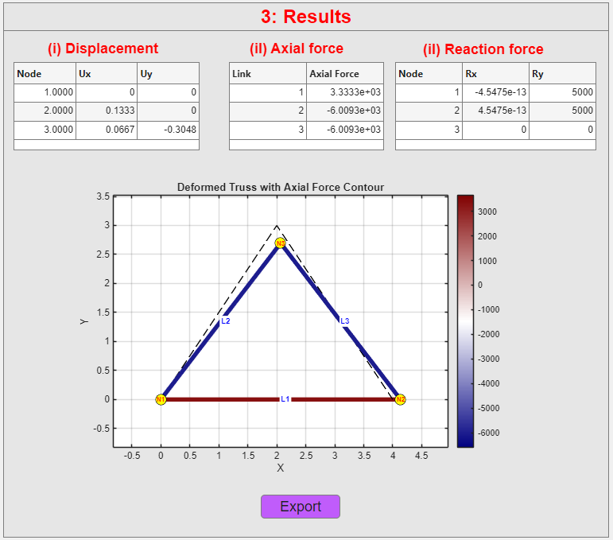

# AnsyTruss-2D

**AnsyTruss-2D** is a MATLAB-based educational tool for interactive two-dimensional truss analysis, visualisation, and reporting.

The tool is designed to support teaching and learning in engineering mechanics by allowing students to define, verify, analyse, and visualise simple 2D pin-jointed truss structures.

## Purpose

AnsyTruss-2D was developed to help students connect theoretical truss analysis concepts with visual and computational results. It provides an interactive environment where users can enter truss data, modify models, observe structural behaviour, and generate analysis reports.

## Main Features

- Define node coordinates
- Define truss links/members
- Assign material and sectional properties
- Assign support conditions
- Apply nodal loads
- Verify truss geometry before analysis
- Analyse 2D pin-jointed trusses
- View nodal displacements, axial forces, and support reactions
- Visualise deformed and undeformed truss shapes
- Export PDF analysis reports

## Downloads

Download the latest version from the [GitHub Releases page](https://github.com/ComputationalMechanicsLab-AUT/AnsyTruss-2D/releases).

Available package includes:

- Windows standalone installer: `AnsyTruss-2D_Windows_Installer.exe`

> MATLAB source code is not publicly distributed in this repository.

## Documentation

- [User Manual](docs/AnsyTruss-2D_user_manual.pdf)

## Example Report

- [Sample PDF Report](examples/AnsyTruss-2D_report.pdf)

## Screenshots

### GUI Overview

### Input Data

### Verification Geometry

### Deformed Truss Result

## Copyright

© 2026 Auckland University of Technology (AUT). All rights reserved.
